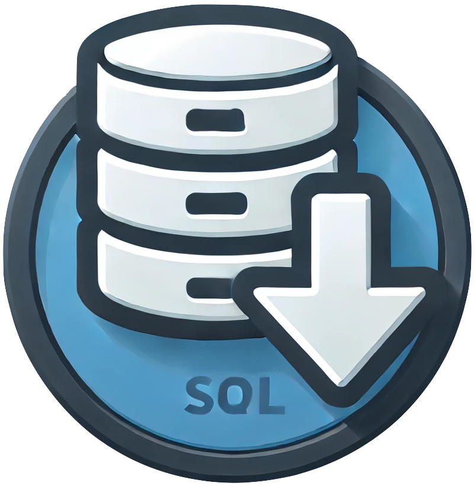

<div align="center">
  
</div>

```
                     ____                
                    / __ )____ _________ 
                   / __  / __ `/ ___/ _ \
                  / /_/ / /_/ / /  /  __/
                 /_____/\__,_/_/   \___/ 
```

Backup Repository. A simple minimalistic service that stores blobs into SQLite and lists them in a simple GUI,


# Environment variables:
*  You can pass `PORT` to select which port number the app runs in. Defaults to 8080.
*  You can pass `AUTH_USERNAME` and `AUTH_PASSWORD` to configure and utilize Basic Auth when accessing the pages
* You can pass `APP_ROOT` if you're serving behind a reverse proxy. This should be the prefix of route you're going to serve
* `DB_PATH` indicates this service where to look for the SQLite file. A this point in time it should be a valid SQLite file since Drizzle struggles with migrations a little bit
* `MAX_REQUEST_BODY_SIZE_MB` defaults to 200. 


# Development

## Setting up
To install dependencies:

```bash
bun install # install dependencies
bun push # will create the sqlite.db for you with the current schema
bun seed # adds an admin token
```

## Running
To develop:

```bash
bun dev
```

# Building

```bash
bun compile # for current platform
# for linux:
bun precompile
bun compile:linux
```

This will nicely scaffold a `dist/` directory that contains all resources for your application:

```
dist/
  bin/
    bare # the server binary. run  it
  migrations/ # directory with drizzle–orm migrations
  assets/
    bare_logo.png # pictures fonts and etc.
  sqlite.db
```


# Deployment

> [!WARNING]  
> Database migration and deployment is unstable:
> Drizzle migrate does not work so you'll have to ship a pre-made SQLite DB.

> [!INFO]  
> In case of running behind a reverse proxy remember to update the max_body_size directive.

```nginx.conf
# example for NGINX
location /bare/ {
  ...
  # Important if you have increased your max body size through env
  client_max_body_size 100M;
  # These are pass the real request IP to Bare.
  proxy_set_header X-Real-IP $remote_addr;
  proxy_set_header X-Forwarded-For $proxy_add_x_forwarded_for;
  # More proxy settings
  proxy_set_header Host $http_host;
  proxy_pass http://localhost:8080;
  proxy_redirect off;
  proxy_http_version 1.1;
}
```

You can just run the setup steps under the `Development > Setting up` section

## Docker and docker-compose

You may use write your own `Dockerfile` while mapping volumes for `sqlite.db` in case you need to back it up

OR

## PM2 ecosystem.config.js file
You may write a `ecosystem.config.js` for PM2

I guess that I will provide these in the repository but I just really wanted to publish this into github :)

## SystemD
You might just comission your `systemd` service using the following template:

```bash
# /etc/systemd/system/bare.service
[Unit]
Description=Backup repository for NanoSpicer
After=network.target
StartLimitIntervalSec=0

[Service]
Type=simple
Restart=always
RestartSec=1
User=root
WorkingDirectory=/opt/bare
Environment="AUTH_USERNAME=username"
Environment="AUTH_PASSWORD=password"
Environment="APP_ROOT=/bare/" # if serving behind a proxy
Environment="DB_PATH=/var/bare/sqlite.db" # assuming this exists
Environment="MAX_REQUEST_BODY_SIZE_MB=125"
ExecStart=/opt/bare/bin/bare
 
[Install]
WantedBy=multi-user.target
```

and then run:

```bash
sudo systemctl daemon-reload
sudo service bare start
# sudo service bare restart
```


# Consuming this service

## BunJS client
```typescript
import { $ } from 'bun'
import chalk from 'chalk'

console.log(chalk.blue('Starting backup...'))

const meta = {
  tags: ['sql', 'your-service']
}

const prependDate = (actualName: string) => {
  const today = new Date()
  const year = today.getFullYear()
  const month = today.getMonth() + 1
  const day = today.getDate()
  return `${year}-${month}-${day}__${actualName}`
}

// This should work as long as PGPASSWORD environment variable is set
const sqlBackup = await $`pg_dump -U user your-database`.text()
const file = new File(
  [contents],
  prependDate('backup.sql'), {
    type: 'application/sql',
    lastModified: Date.now()
  }
)

const formData = new FormData()
formData.append("file", file)
formData.append("meta", JSON.stringify(meta))

const response = await fetch('https://yourdomain.xyz/bare/api/uploads', {
  method: 'POST',
  body: formData,
  headers: {
    ['X-Api-Token']: '<a-token-you-have-created>'
  }
})

console.log(response.status)

if (response.status >= 200 && response.status < 300) {
  console.log(chalk.green('Backup completed!'))
  process.exit(0)
}

console.log(chalk.red('Backup failed!'))
process.exit(1)
```

## A Bash client that you can hook into `crontab`

```bash
#!/bin/bash
echo "Starting backup..."

# Metadata and token
TAGS='["sql", "your-service"]'
API_TOKEN="<a-token-you-have-created>"
UPLOAD_URL="https://yourdomain.xyz/bare/api/uploads"

# Generate a timestamped file name
prepend_date() {
  local actual_name="$1"
  local today
  today=$(date +'%Y-%m-%d')
  echo "${today}__${actual_name}"
}

# Perform the database backup
PGPASSWORD="<your-password>" pg_dump -U user your-database > backup.sql
if [ $? -ne 0 ]; then
  echo "Backup failed during pg_dump!" >&2
  exit 1
fi

# Rename the file with a date prefix
BACKUP_FILE=$(prepend_date "backup.sql")
mv backup.sql "$BACKUP_FILE"

# Prepare the metadata and form data
META="{\"tags\":$TAGS}"

# Use curl to perform the upload
response=$(curl -s -o /dev/null -w "%{http_code}" -X POST \
  -H "X-Api-Token: $API_TOKEN" \
  -F "file=@$BACKUP_FILE" \
  -F "meta=$META" \
  "$UPLOAD_URL")

# Check response status
if [ "$response" -ge 200 ] && [ "$response" -lt 300 ]; then
  echo "Backup completed!"
  exit 0
else
  echo "Backup failed with status code $response!" >&2
  exit 1
fi
```

# License

This tool is published under the terms of the Apache License 2.0.
